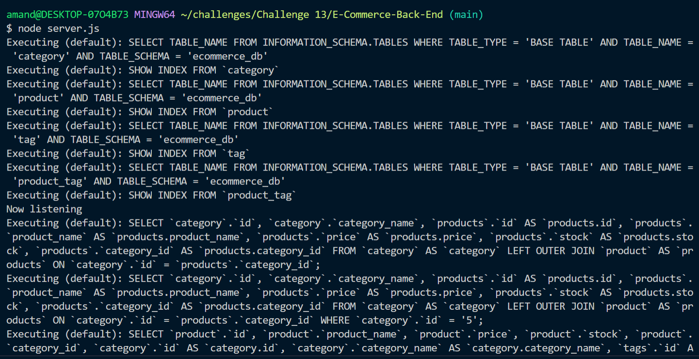
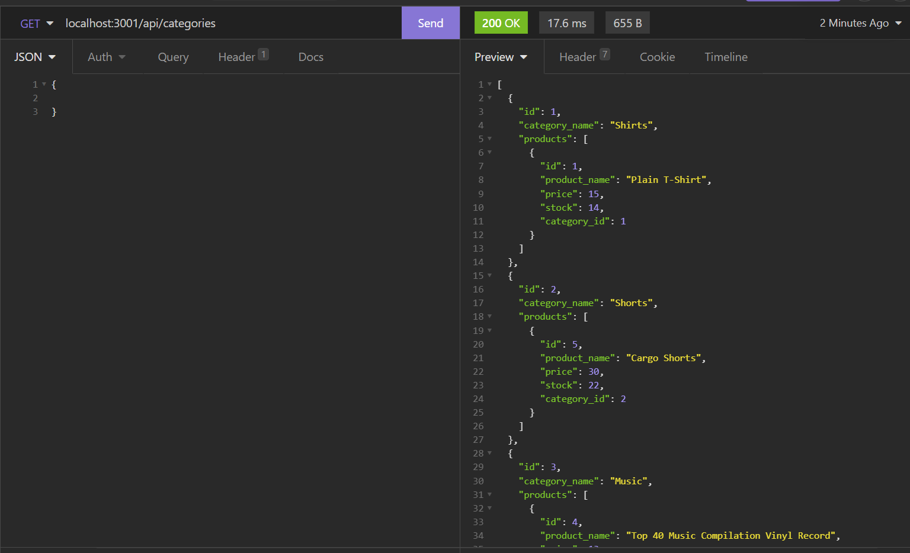

# E-Commerce-Back-End


## Description
This application is designed to help an internet retail company by creating the back end for their e-commerce website that uses the latest technologies so that their site can be competitive. The following were the application's requirements: 
* When given a function Express.js API, the user can enter their database name, MySQL username, and MySQL password to an .env file.
* When the user creates the .env file, they can connect to a database using Sequelize.
* When the user enters the schema and seed commands, a database is created and seeded with test data. 
* When the user enters the command to invoke the application in the terminal, the server is started and the Sequelize models are synced to the MySWL database.
* When the user tests the API GET routes in insomnia for all categories, a specific category, all products, a specific product, all tags, or a specific tag, the data for each of these routes is displayed in formatted JSON.
* When the user tests the API POST, PUT, and DELETE routes for the categories, products, and tags in Insomnia, they will be able to successfully create, update, and delete data in the database.

## Table of Contents
- [Installation](#installation)
- [Links](#links)
- [Usage](#usage)
- [License](#license)
- [How to Contribute](#how-to-contribute)
- [Questions](#questions)

## Installation
Visit the GitHub repository, E-Commerce-Back-End (see the link below), to fork and clone the repository. The JSON file will have the necessary dependencies. Use:
````````````
npm install
````````````
The .gitignore file is set up in the root directory along with the server.js file that contains the code to run the server. The sequelize sync in server.js should be set to
````````````````
{ force: false }
````````````````
, unless the user wants to drop and recreate their database. The seeds folder contains all of the data to populate the table. The user will need to use:
`````````````
npm run seed
`````````````
To populate the tables. The api folder contains the index.js file and the api folder. The index.js file that is not in the api folder is the routing page for all of the routes (with the idea that an html routes folder and files could be added later). Within the api folder in the routes folder, there is an index.js (which routes all of the api routes) and files that contain the routes to get, post, put, and delete data about the categories, products, and tags to the database. The models folder contains an index.js file (which which details and exports the table associations) and the JS files to set up the models for the category, product, tag, and product_tag tables in MySQL using sequelize. The db folder has the schema.sql file where the user can put their database queries to drop and create. The config file contains the connection.js file so that any user can connect to their database using .env variables. The user will need to create a .env file and use the code described in the Usage section to login to their MySQL account and run the application. They will need to add .env to their .gitignore file so that their password is not pushed to GitHub.

## Links
- [GitHub Repository](https://github.com/amklenk/E-Commerce-Back-End)
- [Walkthrough Video 1 Link for Setup and Running the Server](https://drive.google.com/file/d/1oqR0_LpOv3HVmzhalRDqLmo5eQkTGo7H/view?usp=sharing)
- [Walkthrough Video 2 Link for Get and Get by Id Functionality](https://drive.google.com/file/d/1NYr3K-QktNpV8T0SzBs2H7GR5ljaigHL/view?usp=sharing)
- [Walkthrough Video 3 Link for Post Functionality](https://drive.google.com/file/d/1oUvrDNOsybouuSdnqRuP2FSYAfjTR_A1/view?usp=sharing)
- [Walkthrough Video 4 Link for Put and Delete Functionality](https://drive.google.com/file/d/1ovx8QpuSi0_GBmIw1_hXwLGC5iANd_iO/view?usp=sharing)

## Usage
The following are screenshots of:

Running the Server in the Bash Terminal


Testing With Insomnia (GET route for all categories)


Before starting the application, the user needs to create a .env file in their root directory to connect to their local MySQL database. They will need to put the following code in their .env file, filling in their own data for the values:

``````````````````````````````
DB_NAME="user's database"
DB_USER="root"
DB_PASSWORD="userpasswordhere"
``````````````````````````````

 The application is navigable via opening the server.js file in an integrated terminal. To run the application, the user should type
``````````````
node server.js
``````````````
into the terminal. This will start the server. The user can then use Insomnia to interact with the database.

## License
The badge at the top of the page shows that this project is licensed under MIT. The link for that license is shown below.
- [License: MIT](https://opensource.org/licenses/MIT)
## How to Contribute
Please fork and clone the repository and use a pull request to add or make changes to the current repository.

## Questions
Please direct any questions to amandamklenk3@gmail.com. To see more projects, visit the link below for amklenk's respository:
- [GitHub Repository](https://github.com/amklenk)

